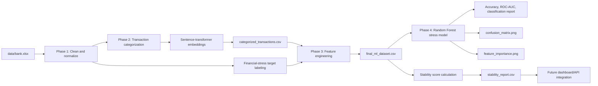
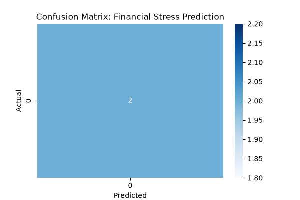
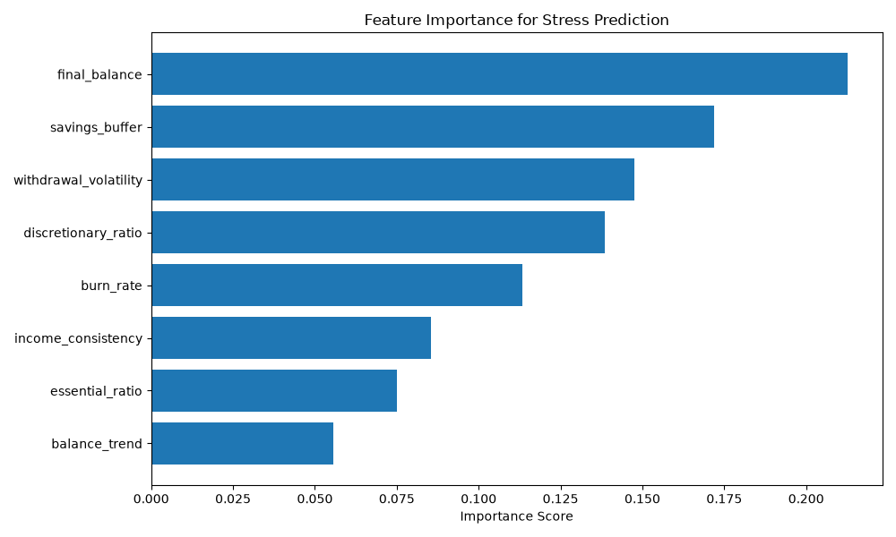

# CreditBridge

## Explainable financial stability assessment for credit-invisible people

CreditBridge is an AI/ML finance project that analyzes bank-transaction behavior and converts it into understandable financial-readiness insights. The project is designed for people who may not have a traditional credit history, including students, recent graduates, immigrants, and first-time borrowers.

The current repository implements a data and machine-learning pipeline for transaction cleaning, few-example transaction categorization, financial feature engineering, financial-stress labeling, stress-model training, and explainable stability reporting.

The current release is a research prototype. It is not an official credit-score provider and must not be used for automatic loan approval or rejection.

## 1. Problem statement

Students, recent graduates, immigrants, and first-time borrowers can be financially responsible while remaining difficult for traditional credit systems to assess because they have limited or no formal credit history. Small financial institutions and community organizations also often lack the data infrastructure and machine-learning resources needed to interpret raw bank statements.

CreditBridge addresses this problem by using transaction behavior—deposits, withdrawals, balances, dates, and descriptions—to create an explainable financial stability profile.

## 2. Why the problem matters

Traditional credit systems can mistake a lack of credit history for a lack of financial reliability. This can restrict access to starter financial products, savings support, and responsible credit-building opportunities.

Transaction data can provide additional context about cash-flow regularity, spending pressure, savings buffers, and balance trends. Making these signals understandable can help users and support organizations identify financial strengths and areas that need attention.

CreditBridge is designed as a decision-support and financial-awareness tool. It does not infer immigration status, student status, or other sensitive identity attributes from transaction data.

## 3. Solution overview

The system processes a bank statement and produces:

- Cleaned transaction data
- Few-example transaction categories
- Account-level financial features
- A derived financial-stress label for research use
- A Random Forest financial-stress model
- A transparent 0–100 stability score
- Positive financial signals
- Risk signals
- A recommended next action

The current prototype uses a small number of manually provided category examples to demonstrate how an organization could adapt transaction categorization to its own data.

## 4. Architecture diagram



## 5. Dataset description

The project uses `data/bank.xlsx`, a transaction-level bank-statement dataset.

| Dataset field | Description | Use in the pipeline |
| --- | --- | --- |
| `Account No` | Account identifier | Groups transactions; not used as a predictive feature |
| `DATE` | Transaction date | Time ordering and monthly aggregation |
| `TRANSACTION DETAILS` | Raw transaction description | Transaction categorization |
| `WITHDRAWAL AMT` | Money withdrawn | Spending and burn-rate features |
| `DEPOSIT AMT` | Money deposited | Income and cash-flow features |
| `BALANCE AMT` | Account balance after a transaction | Balance trend, buffer, and stress labeling |

The preprocessing stage renames these fields to Python-friendly names, removes unnecessary columns, cleans account identifiers, converts numeric values, removes invalid balance extremes, parses dates, and sorts records by account and date.

Raw financial data should not be uploaded to a public repository unless it has been anonymized and permission has been obtained.

## 6. Machine-learning pipeline

### Phase 1: Data cleaning and target labeling

`ml/phase1_run.py` calls `ml/data_preprocessing.py` to:

1. Load `data/bank.xlsx`.
2. Rename and retain the required fields.
3. Clean account numbers and numeric values.
4. Parse and sort transaction dates.
5. Calculate average monthly deposits per account.
6. Create `is_stressed` using the prototype rule:

```text
is_stressed = 1 when balance < 10% of average monthly deposits
```

7. Extract initial account-level features.
8. Save `ml/processed_financial_data.csv`.

### Phase 2: Few-example transaction categorization

`ml/phase2_run.py` uses `ml/transaction_categorizer.py` and the `all-MiniLM-L6-v2` sentence-transformer model.

Seed examples are provided for categories such as:

- Housing
- Income
- Food
- Cash
- Transport
- Shopping
- Utility

The model embeds the seed descriptions, calculates category centroids, and assigns each transaction to the closest category using cosine similarity. Low-similarity descriptions are returned as `Other/Unknown`.

The output is saved as `ml/categorized_transactions.csv`.

### Phase 3: Feature engineering

`ml/phase3_run.py` calls `ml/feature_engineering.py` to calculate account-level features including:

- Burn rate
- Essential-spending ratio
- Discretionary-spending ratio
- Withdrawal volatility
- Savings buffer
- Income consistency
- Balance trend
- Final balance

The final modeling dataset is saved as `ml/final_ml_dataset.csv`.

### Phase 4: Financial-stress model

`ml/phase4_run.py` trains a class-balanced Random Forest classifier using the engineered numerical features. `account_number` is excluded from the model.

The script calculates:

- Accuracy
- ROC-AUC
- Classification report
- Confusion matrix
- Feature importance

It saves:

- `ml/stress_model.joblib`
- `ml/confusion_matrix.png`
- `ml/feature_importance.png`

### Stability reporting

`ml/stability_report.py` calculates a weighted 0–100 stability score using:

| Component | Weight |
| --- | ---: |
| Savings buffer | 30% |
| Income consistency | 20% |
| Burn rate | 20% |
| Withdrawal volatility | 15% |
| Balance trend | 15% |

It also generates positive signals, risk signals, and recommendations. The output is saved as `ml/stability_report.csv`.

## 7. Evaluation results

### Stability report

The committed prototype report contains four account-level profiles. The generated stability scores are:

| Metric | Result |
| --- | ---: |
| Number of generated profiles | 4 |
| Lowest stability score | 18.6 |
| Highest stability score | 24.0 |
| Average stability score | Approximately 20.8 |

The generated report identifies highly volatile spending and low emergency buffers as the main risk signals for these profiles.

### Stress-model evaluation

The stress-model script computes accuracy, ROC-AUC, and a classification report each time it is run. The latest metric values should be taken from the terminal output produced by `python ml/phase4_run.py`; the repository also includes the generated confusion matrix and feature-importance plots.

Because the stress label is derived from a balance-to-income rule rather than observed loan repayment outcomes, these metrics measure agreement with the prototype labeling rule. They must not be interpreted as real-world default-prediction performance.

## 8. Screenshots and generated visual outputs

### Confusion matrix



### Feature importance



The stability report can be found at [`ml/stability_report.csv`](ml/stability_report.csv).

## 9. Installation and usage

### Requirements

- Python 3.9 or newer
- Internet access during the first run of the sentence-transformer model
- The packages listed in `requirements.txt`

### Windows setup

From the repository root:

```powershell
python -m venv venv
.\venv\Scripts\Activate.ps1
pip install -r requirements.txt
```

If PowerShell blocks activation for the current terminal session:

```powershell
Set-ExecutionPolicy -Scope Process -ExecutionPolicy Bypass
.\venv\Scripts\Activate.ps1
```

The included `setup_env.ps1` script performs the same environment setup.

### Run the complete pipeline

Run these commands from the repository root and in this order:

```powershell
python ml/phase1_run.py
python ml/phase2_run.py
python ml/phase3_run.py
python ml/phase4_run.py
python ml/stability_report.py
```

The phase order matters because each phase creates files consumed by the next phase.

## 10. Limitations and responsible-AI notes

- The dataset does not contain verified immigrant, student, graduate, credit-score, loan-approval, or loan-repayment labels.
- The project therefore does not identify protected groups and does not claim to predict official creditworthiness.
- The financial-stress target is a proxy label based on account balance and average deposits.
- A transaction deposit is not necessarily salary or income; transfers may be mislabeled as income.
- Sentence-transformer categorization depends on the quality of the seed examples.
- A small number of accounts is not sufficient to validate generalization to new populations.
- Account identifiers must never be used as predictive features.
- Raw bank statements should be anonymized and handled securely.
- The stability score is decision support only and must not automatically approve, reject, price, or deny a financial product.
- Human review is required before any consequential financial action.

## 11. Team members and contributions

Update this table with the final team names before submission.

| Team member | Contribution |
| --- | --- |
| Member 1 | Data preprocessing, data validation, and dataset documentation |
| Member 2 | Transaction categorization and feature engineering |
| Member 3 | Financial-stress model, evaluation, and explainability |
| Member 4 | Product design, integration, documentation, and presentation |

## 12. Demo link

Add the deployed demo or video link here:

```text
Demo: [Add demo URL]
Figma: [Add Figma URL]
```

## Repository structure

```text
DDT_Hack/
├── data/
│   └── bank.xlsx
├── ml/
│   ├── data_preprocessing.py
│   ├── transaction_categorizer.py
│   ├── feature_engineering.py
│   ├── stability_report.py
│   ├── phase1_run.py
│   ├── phase2_run.py
│   ├── phase3_run.py
│   ├── phase4_run.py
│   ├── predict_customer.py
│   ├── stress_model.joblib
│   ├── stability_report.csv
│   ├── confusion_matrix.png
│   └── feature_importance.png
├── requirements.txt
├── setup_env.ps1
└── README.md
```

